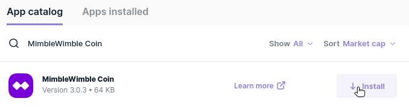
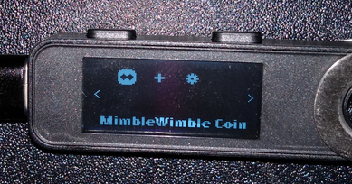
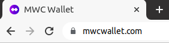
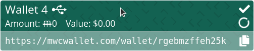
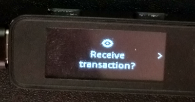
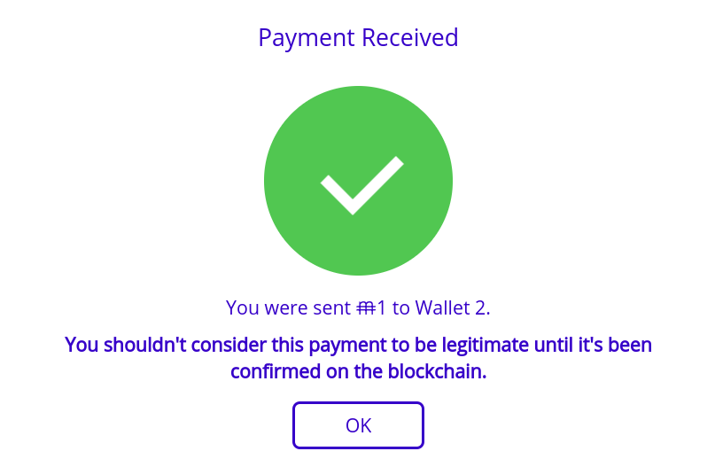
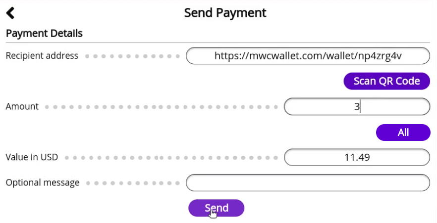

## Introduction

Hardware wallets provide a secure way to manage your crypto assets by keeping your private keys offline. This guide will help you connect your Ledger hardware wallet to the [MimbleWimble Coin web wallet](https://mwcwallet.com) which will allow you to send and receive MimbleWimble Coin with your Ledger hardware wallet.

## Quick Links

* [Requirements](#user-content-requirements)
* [Installation Instructions](#user-content-installation-instructions)
* [Setup Instructions](#user-content-setup-instructions)
* [How To View Your MimbleWimble Coin Balance](#user-content-how-to-view-your-mimblewimble-coin-balance)
* [How To Receive MimbleWimble Coin](#user-content-how-to-receive-mimblewimble-coin)
* [How To Send MimbleWimble Coin](#user-content-how-to-send-mimblewimble-coin)
* [Support](#user-content-support)

## Requirements

1. [You've initialized your Ledger hardware wallet.](https://support.ledger.com/hc/en-us/articles/360000613793-Set-up-your-Ledger-Nano-S?docs=true)
2. [The latest firmware is installed on your Ledger hardware wallet.](https://support.ledger.com/hc/en-us/articles/360002731113-Update-Ledger-Nano-S-firmware?docs=true)
3. [You have Ledger Live Desktop installed.](https://support.ledger.com/hc/en-us/articles/4404389606417-Download-and-install-Ledger-Live?docs=true)

## Installation Instructions

1. Open Ledger Live Desktop and click the My Ledger section.  

	

  

2. Connect your Ledger hardware wallet to your computer, find the MimbleWimble Coin app in the App catalog, and click its Install button.  

	

  

3. The MimbleWimble Coin app will be available on your Ledger hardware wallet once the installation completes.  

	

  

## Setup Instructions

1. Go to the MimbleWimble Coin web wallet, [https://mwcwallet.com](https://mwcwallet.com), with a web browser that supports [WebUSB](https://caniuse.com/webusb), like Google Chrome.  

	

  

2. Create an account if you have not already done so, otherwise log into your account.  

	

  

3. Click the Hardware button in the wallets list.  

	

  

4. Open the MimbleWimble Coin app on your Ledger hardware wallet and choose to connect to the device in your web browser.  

	

  

5. Approve exporting the root public key on your Ledger hardware wallet.  

	

  

6. The hardware wallet will now be listed in your wallets list.  

	

  

## How To View Your MimbleWimble Coin Balance

1. Click the hardware wallet in the wallets list.  

	

  

2. Once the hardware wallet has finished syncing, its MimbleWimble Coin balance will be displayed in the Balance section.  

	

  

## How To Receive MimbleWimble Coin

1. Verify that the MimbleWimble Coin web wallet is connected to a listener. You can only receive payments while you are online and connected to a listener.  

	

  

2. Connect your Ledger hardware wallet to your computer, and click the hardware wallet in the wallets list.  

	

  

3. Provide the payment sender with the QR code or address listed in the Address section.  

	

  

4. Click the Get Payment Proof Address button in the Utilities section.  

	

  

5. Verify that the Tor address displayed on your hardware wallet matches the one displayed in the MimbleWimble Coin web wallet.  

	

  

6. Provide the payment sender with the payment proof address so that they can confirm that they are truly sending MimbleWimble Coin to you.  

	

  

7. After the sender sends you the transaction, confirm the amount, fee, kernel features, and sender payment proof address displayed on your Ledger hardware wallet before approving receiving the transaction.  

	

  

8. The MimbleWimble Coin web wallet will show a message with a check mark if the transaction response is successfully sent to the sender.  

	

  

## How To Send MimbleWimble Coin

1. Verify that the MimbleWimble Coin web wallet is connected to a node. You can only send payments when you are connected to a node.  

	

  

2. Connect your Ledger hardware wallet to your computer, and click the hardware wallet in the wallets list.  

	

  

3. Click the Send Payment button in the Balance section.  

	

  

4. Click the Send button after filling in the Recipient address and Amount fields.  

	

  

5. Confirm the payment details, enter your password, and click the Continue button to start sending the payment.  

	

  

6. After the recipient signs the transaction, confirm the amount, fee, kernel features, and recipient payment proof address displayed on your Ledger hardware wallet before approving sending the transaction.  

	

  

7. The message displayed in the MimbleWimble Coin web wallet will show a check mark if the transaction is successfully broadcast.  

	

  

## Support

* MimbleWimble Coin Forum: [https://forum.mwc.mw](https://forum.mwc.mw)
* Github: [https://github.com/NicolasFlamel1/Ledger-MimbleWimble-Coin/issues](https://github.com/NicolasFlamel1/Ledger-MimbleWimble-Coin/issues)
